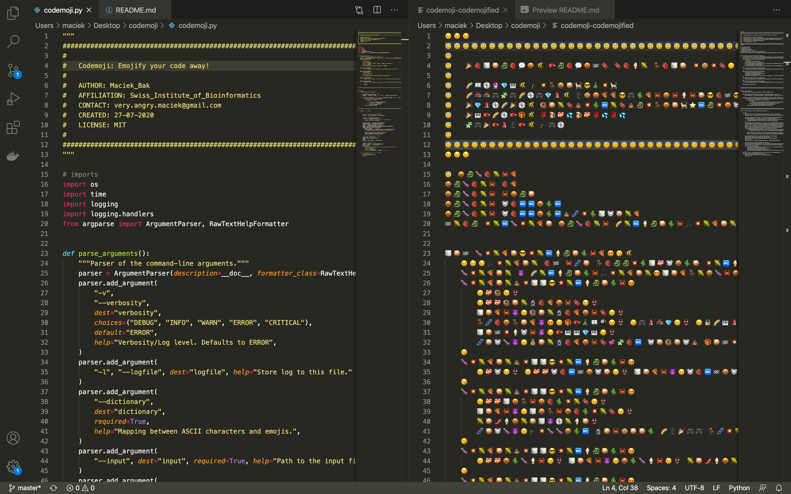

# Codemoji 💥

> *Emojify your code away!*

*Maciek Bak*

## About

**Do you also hate reading someone else's code?**  

How many times did you have to dwell into a complete nonsense? But eventually the job needs to be done so you spent days trying to work things out all by yourself and there was nothing you could do about it...

Now you have your chance to retaliate! Prior sharing, convert your work into a beautiful sequence of colorful images and watch your adversaries cry blood while trying to decypther the source code :)

## Execution

## License

MIT License

[Python 3]: https://www.python.org/download/releases/3.0/
[git]: https://git-scm.com/
